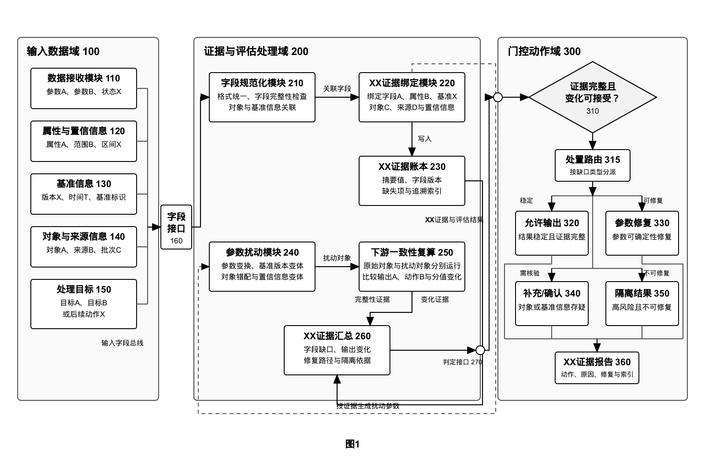
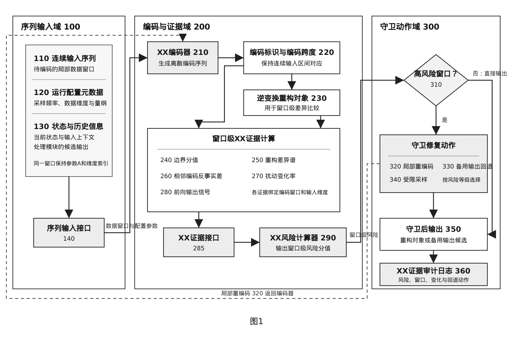

# patentfig

一个把学术风格的系统/概念/算法图转化为专利附图的skill

## 为什么使用 patentfig

这个 skill 解决的是：如何把计算机/人工智能领域论文中的系统图、概念图或算法流程，一键整理成结构清晰、标注规范、可继续编辑的专业专利附图。

- 从论文或技术说明中提取系统边界、模块关系、数据流和控制流；
- 将论文式表达重排为专利附图的模块、接口、附图标记和反馈路径；
- 同时输出可编辑 SVG 与预览 PNG，并记录来源页码和术语依据；
- 避免照搬原图或补写输入材料没有支持的技术机制。

## 示例

以下示例仅展示版式与绘图流程，不涉及敏感/隐私或者实际专利附图。

### 示例1



[查看可编辑 SVG](examples/example1.svg)

### 示例2



[查看可编辑 SVG](examples/example2.svg)

## 使用

```bash
python3 skills/patent-figure-redraw/scripts/patent_figure_ops.py init demo topic.md
python3 skills/patent-figure-redraw/scripts/patent_figure_ops.py validate \
  demo/patent-figures/figure-manifest.json --draft
python3 skills/patent-figure-redraw/scripts/patent_figure_ops.py render \
  demo/patent-figures/editable/fig1.svg demo/patent-figures/raster/fig1.png
```

完整规则见 [`skills/patent-figure-redraw/SKILL.md`](skills/patent-figure-redraw/SKILL.md)。

## 声明

- 仓库内示例均为合成演示数据，不涉及任何真实、已申请或已公开的专利；如有雷同，纯属巧合。
- patentfig 仅是绘图辅助工具，不构成专利、法律或新颖性方面的意见。

## 许可

代码采用 Apache License 2.0；图库素材还需单独确认来源与发布许可。
